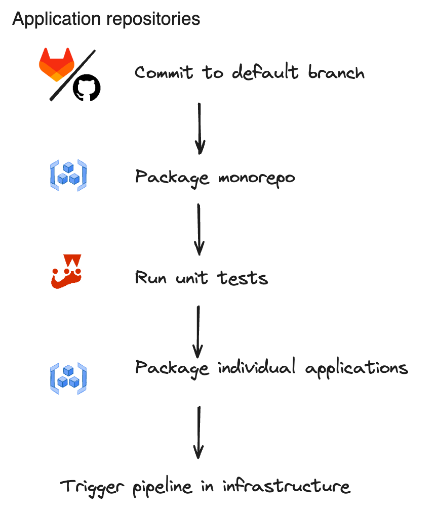

# Application repository

Imagine this repository is a monorepo, and ./some-application-folder is one of several applications that are part of it. Each one of the applications would have a ci-package.yml file. This particular file is responsible for packing the image that is ultimately deployed in your container.

